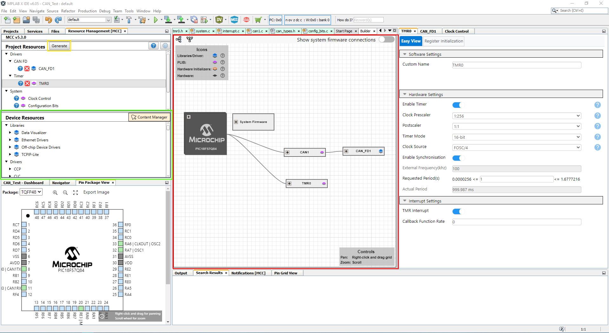
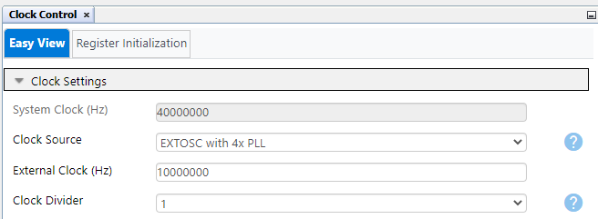
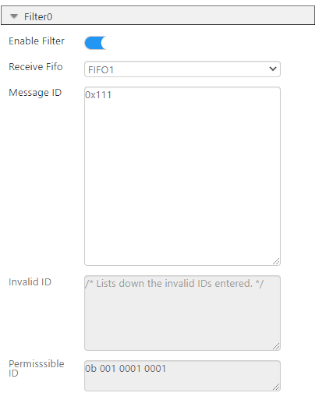

[](https://www.microchip.com)

# CAN FD Setup For the PIC18-Q84 Family of Microcontrollers

This example project showcases the setup and use of the new CAN FD module on the PIC18-Q84 family of devices using MPLAB Code Configurator (MCC). This software speeds up the configuration time and hassle for settings such as baud rate, receive masks/filters, and handling receive/transmit FIFOs.

The example functionality includes periodically transmitting CAN frames on 1 second intervals, echoing incoming messages with a specific message ID (0x111), and setting LEDs based on data with a different specific message ID (0x585).  

## Related Documentation

Configuring the PIC18 CAN FD Module found in [TB3266](https://ww1.microchip.com/downloads/aemDocuments/documents/MCU08/ProductDocuments/ProductBrief/90003266A.pdf)

## Software Used
- MPLAB® X IDE 6.0.5 or newer [(MPLAB® X IDE 6.0)](https://www.microchip.com/en-us/tools-resources/develop/mplab-x-ide?utm_source=GitHub&utm_medium=TextLink&utm_campaign=MCU8_MMTCha_pic18q84&utm_content=pic18f47q84-can-fd-basic-operation-mplab-mcc&utm_bu=MCU08)
- MPLAB® XC8 2.41.0 or newer compiler [(MPLAB® XC8 2.41)](https://www.microchip.com/en-us/tools-resources/develop/mplab-xc-compilers?utm_source=GitHub&utm_medium=TextLink&utm_campaign=MCU8_MMTCha_pic18q84&utm_content=pic18f47q84-can-fd-basic-operation-mplab-mcc&utm_bu=MCU08)

## Hardware Used

  - [PIC18F57Q84 Curiosity Nano](https://www.microchip.com/en-us/development-tool/DM182030?utm_source=GitHub&utm_medium=TextLink&utm_campaign=MCU8_MMTCha_pic18q84&utm_content=pic18f47q84-can-fd-basic-operation-mplab-mcc&utm_bu=MCU08)
  - [Curiosity Nano Base Board](https://www.microchip.com/en-us/development-tool/AC164162?utm_source=GitHub&utm_medium=TextLink&utm_campaign=MCU8_MMTCha_pic18q84&utm_content=pic18f47q84-can-fd-basic-operation-mplab-mcc&utm_bu=MCU08)
  - [ATA6563 Click Board](https://www.mikroe.com/ata6563-click)
  - [K2L Optolyzer® MOCCA FD](https://www.microchip.com/en-us/tools-resources/develop/k2l-automotive-tools?utm_source=GitHub&utm_medium=TextLink&utm_campaign=MCU8_MMTCha_pic18q84&utm_content=pic18f47q84-can-fd-basic-operation-mplab-mcc&utm_bu=MCU08)

## Setup

The hardware consists of a [PIC18F57Q84 Curiosity Nano](https://www.microchip.com/en-us/development-tool/DM182030?utm_source=GitHub&utm_medium=TextLink&utm_campaign=MCU8_MMTCha_pic18q84&utm_content=pic18f47q84-can-fd-basic-operation-mplab-mcc&utm_bu=MCU08), which breaks out the microcontroller's pins as well as serves as the programmer/debugger. The [Curiosity Nano Base Board](https://www.microchip.com/en-us/development-tool/AC164162?utm_source=GitHub&utm_medium=TextLink&utm_campaign=MCU8_MMTCha_pic18q84&utm_content=pic18f47q84-can-fd-basic-operation-mplab-mcc&utm_bu=MCU08) serves as a backplane for connecting the Q84's CAN TX/RX pins to the ATA6563. From there, the ATA6563 converts the incoming TX/RX into the differential pair required for CAN communication.

Some form of CAN FD capable CAN bus analyzer is needed to view the outgoing CAN frames and send incoming CAN frames to the device (the K2L MOCCA FD was used for this setup).

#### Hardware Setup:


### MCC Walkthrough:
This section is for first time MCC users. To start, create a new standalone project in MPLAB X with the PIC18F57Q84 as the selected microcontroller. After being greeted by the text editor, open up MCC by selecting this button. If you haven't installed MCC yet, follow [this guide first](https://onlinedocs.microchip.com/pr/GUID-1F7007B8-9A46-4D03-AEED-650357BA760D-en-US-6/index.html?GUID-D98198EA-93B9-45D2-9D96-C97DBCA55267).


From there, click "Select MCC Melody" and finish. You will be met with the application builder (highlighted in red). To configure a module, double-click it from the devices resources (green) and it will
1. Move into Project Resources
2. Show up in the builder
3. Pull up it's configuration window on the right when you can configure it's parameters.

#### When you are ready to generate the application code, click generate (yellow)



### Project Configuration:
Before configuring CAN, change these other configuration settings. Configure the "Clock Control" module to use the external 10Mhz crystal oscillator, then the internal PLL to get an operating frequency of 40Mhz. (As mentioned in [TB3266](https://ww1.microchip.com/downloads/aemDocuments/documents/MCU08/ProductDocuments/ProductBrief/90003266A.pdf) 10Mhz, 20Mhz, or 40Mhz are the CAN FD hardware supported speeds)



Next, in the "Configuration Bits" module, change the External Oscillator Selection setting and disable JTAG. This is needed because JTAG shares the same pins as the CAN TX pin, so this prevents JTAG from interferring with CAN communications.


## CAN Configuration

To configure CAN FD, add the "CAN FD" module from the "Device Resources" section.
The setup process has 5 sections. The first is clock setup. For this setup, configure the CAN1 PLIB to use FOSC, then move onto the CAN1_FD configuration window


The second step is Bit Rate Settings. This configures the nominal and data bit rate (if applicable) based on FCAN. For this example, a 500 Kbps nominal rate and 2Mbps data rate are selected, the nominal bit rate having 80 TQs per bit, the data bit rate having 20 TQs per bit, and the sample point being 80% for both bit rates.


The third step is general settings. This only has two options: Enable ISO CRC and Enable Error Interrupt. The ISO CRC is a standard for CAN FD and is in enabled for this example, but some older CAN FD devices/buses may use the non-ISO CRC. The Error Interrupt is for potential issues on messages/buses, and is not used in this demonstration.

The fourth step is the FIFO settings. Here is where the transmit and receive FIFOs are set up. It allows for setting up depth, payload size, and TX/RX selection for each FIFO, while showing how much of the FIFO space is being consumed by the currently selected FIFOs. In addition, this allows for selecting specific interrupt triggers for each FIFO which will generate the function prototypes/pointers for these interrupts in the code. In this example, the TXQ is used as the transmit FIFO, with FIFO1 and FIFO2 being set as receive. All three are set to a depth of 6 and a payload of 32 bytes, with both receive FIFOs set to interrupt on not-empty.


The fifth and final step is the Filter Object Settings. This allows for setup of masks and filters, which determine which message IDs are accepted. Each filter object can be associated with a specific receive FIFO and any number of message IDs can be entered, which will automatically set up the masks/filters to accept those IDs. FIFO1 will respond to messages with an ID of 0x111 and FIFO2 will respond to messages with an ID of 0x585. We will setup their responses later in code.




#### TMR0 Configuration:
The last thing that needs configured in MCC is Timer 0. In the feature list, we wanted to "periodically transmitting CAN frames on 1 second intervals". We will use the TMR0 module to generate an interrupt every 1 second so that the periodic CAN FD messages can be sent. Add the TMR0 module from the device resources and configure it as follows. Similar the CAN FIFO interrupts, we will have to manually code the interrupt behavior later.


#### Pin Configuration:
The final step is the setup which pins are inputs and outputs using the Pin Grid View. Setup PORTB0 as CANTX and PORTB3 as CANRX. Remember: JTAG has to be disabled for PORTB0 to work as CANTX.

Also, configure pin PORTF3 as an output to control the on-board LED.

#### Pin Grid View Window:


Click the Generate button in MCC and it will generate the application code. You can now close MCC.

### Interrupt Code
We need to implement 3 functions manually for each interrupt: the response for each FIFOs and the TMR0 interrupt code.

Open `can1.c`. Include the neccessary pins header file at the top `#include "../../can/can1.h"` below the other includes. Create these 2 functions somewhere in `can1.c`:
```c
static void CAN1_FIFO1DefaultHandler(void)
{
    struct CAN_MSG_OBJ EchoMessage;  //create a message object for holding the data
    while(1)
    {
        if(CAN1_ReceivedMessageCountGet() > 0) //check for received message
        {
            if(true == CAN1_Receive(&EchoMessage)) //receive the message
            {
                break;
            }
        }
    }
    EchoMessage.msgId=0x222; //Change the ID to 0x222 then echo the message back out
    if(CAN_TX_FIFO_AVAILABLE == (CAN1_TransmitFIFOStatusGet(CAN1_TXQ) & CAN_TX_FIFO_AVAILABLE))
    {
        CAN1_Transmit(CAN1_TXQ, &EchoMessage); //Send the message
    }
}

static void CAN1_FIFO2DefaultHandler(void)
{
    struct CAN_MSG_OBJ InternalMessage; //create a message object for holding data
    while(1)
    {
        if(CAN1_ReceivedMessageCountGet() > 0) //check for received message
        {
            if(true == CAN1_Receive(&InternalMessage)) //receive the message
            {
                break;
            }
        }
    }
    IO_RF3_LAT = ~(InternalMessage.data[0] & 0b1); // set if fist bit is 1 or 0

}
```
Next, in `CAN1_RX_FIFO_Configuration()` (~line 514), setup the call back to these 2 functions 

```c
CAN1_FIFO1NotEmptyCallbackRegister(CAN1_FIFO1DefaultHandler);
CAN1_FIFO2NotEmptyCallbackRegister(CAN1_FIFO2DefaultHandler);
```
Next, open `TMR0.c`. The last piece of code to add is what to do when the TMR0 interrupt occurs. First, include the neccessary CAN header at the top `#include "../../can/can1.h"`, then fill out this function that is in the bottom of `TMR0.c`:
```c
void TMR0_DefaultInterruptHandler(void){
    //Add your interrupt code here or
    //Use TMR0_OverflowCallbackRegister function to use Custom ISR
    struct CAN_MSG_OBJ Transmission;  //create the CAN message object
    uint8_t Transmit_Data[8]={0x00,0x11,0x22,0x33,0x44,0x55,0x66,0x77}; // data bytes
    Transmission.field.brs=CAN_BRS_MODE; //Transmit the data bytes at data bit rate
    Transmission.field.dlc=DLC_8; //8 data bytes
    Transmission.field.formatType=CAN_FD_FORMAT; //CAN FD frames 
    Transmission.field.frameType=CAN_FRAME_DATA; //Data frame
    Transmission.field.idType=CAN_FRAME_STD; //Standard ID
    Transmission.msgId=0x100; //ID of 0x100
    Transmission.data=Transmit_Data; //transmit the data from the data bytes
    if(CAN_TX_FIFO_AVAILABLE == (CAN1_TransmitFIFOStatusGet(CAN1_TXQ) & CAN_TX_FIFO_AVAILABLE))//ensure that the TXQ has space for a message
    {
        CAN1_Transmit(CAN1_TXQ, &Transmission); //transmit frame
    }  
}
```
Finally, just setup your main function in `main.c`:
```c
#include "mcc_generated_files/system/system.h"

int main(void)
{
    SYSTEM_Initialize();

    // Enable the Global High Interrupts 
    INTERRUPT_GlobalInterruptHighEnable(); 

    // Enable the Global Low Interrupts 
    INTERRUPT_GlobalInterruptLowEnable(); 


    while(1)
    {
    }    
}
```
The configuration of the project is done. Click Make and Program Device and your Q84 should be ready to send and receive CAN messages.

## Operation

On Power up, the code will periodically transmit messages with an ID of 0x100 and 8 bytes of data (data = 0x0011223344556677) every 1 second.


Sending the Q84 a message with an ID of 0x111 will cause the device to respond with an echo frame with an ID of 0x222 and identical data frames


Sending a message with an ID of 0x585 will set the on-board LED to change to the value of the first bit (1 = on, 0 = 0ff)


## Summary

This demo gives basic examples of using MCC to perform CAN FD bit rate setup, message transmission, and message reception with both filtering and interrupt-driven responses.
