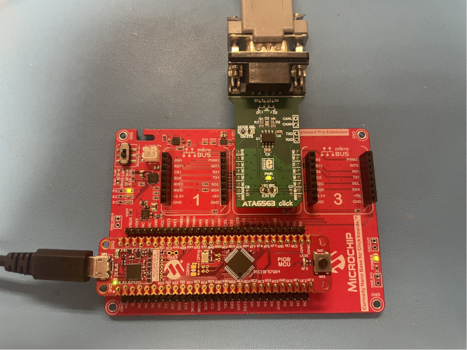
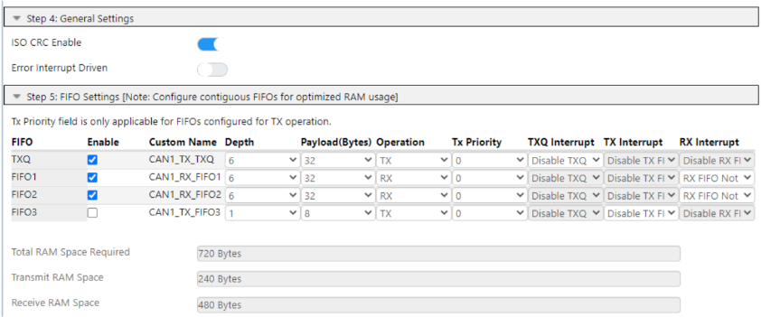
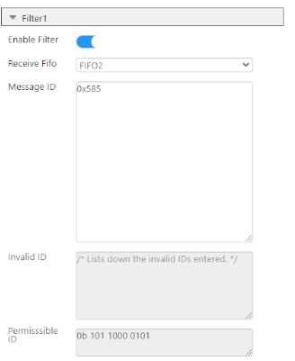

[](https://www.microchip.com)

# CAN FD Setup For the PIC18-Q84 Family of Microcontrollers

This project showcases the setup and use of the new CAN FD (Controller Area Network Flexible Data-Rate) module on the PIC18-Q84 family of devices using MPLAB® Code Configurator (MCC) Melody. This software speeds up the configuration time and hassle for settings such as baud rate, receive masks/filters and handling receive/transmit FIFO buffers.

This example's functionality includes periodically transmitting CAN frames on 1s intervals, echoing incoming messages with a specific message ID (0x111), and setting LEDs based on data with a different specific message ID (0x585).  

## Related Documentation

Configuring the PIC18 CAN FD Module found in [TB3266 - Basic Configuration of the PIC18 CAN FD Module](https://ww1.microchip.com/downloads/aemDocuments/documents/MCU08/ProductDocuments/ProductBrief/90003266A.pdf)

## Software Used
- [MPLAB X IDE 6.0.5](https://www.microchip.com/en-us/tools-resources/develop/mplab-x-ide?utm_source=GitHub&utm_medium=TextLink&utm_campaign=MCU8_MMTCha_pic18q84&utm_content=pic18f47q84-can-fd-basic-operation-mplab-mcc&utm_bu=MCU08) or newer 
- [MPLAB XC8 2.41.0]((https://www.microchip.com/en-us/tools-resources/develop/mplab-xc-compilers?utm_source=GitHub&utm_medium=TextLink&utm_campaign=MCU8_MMTCha_pic18q84&utm_content=pic18f47q84-can-fd-basic-operation-mplab-mcc&utm_bu=MCU08)) or newer compiler

## Hardware Used

  - [PIC18F57Q84 Curiosity Nano](https://www.microchip.com/en-us/development-tool/DM182030?utm_source=GitHub&utm_medium=TextLink&utm_campaign=MCU8_MMTCha_pic18q84&utm_content=pic18f47q84-can-fd-basic-operation-mplab-mcc&utm_bu=MCU08)
  - [Curiosity Nano Base for Click boards™](https://www.microchip.com/en-us/development-tool/AC164162?utm_source=GitHub&utm_medium=TextLink&utm_campaign=MCU8_MMTCha_pic18q84&utm_content=pic18f47q84-can-fd-basic-operation-mplab-mcc&utm_bu=MCU08)
  - [ATA6563 Click boardd](https://www.mikroe.com/ata6563-click)
  - [K2L OptoLyzer® MOCCA FD](https://www.microchip.com/en-us/tools-resources/develop/k2l-automotive-tools?utm_source=GitHub&utm_medium=TextLink&utm_campaign=MCU8_MMTCha_pic18q84&utm_content=pic18f47q84-can-fd-basic-operation-mplab-mcc&utm_bu=MCU08)

## Setup

The hardware consists of a [PIC18F57Q84 Curiosity Nano](https://www.microchip.com/en-us/development-tool/DM182030?utm_source=GitHub&utm_medium=TextLink&utm_campaign=MCU8_MMTCha_pic18q84&utm_content=pic18f47q84-can-fd-basic-operation-mplab-mcc&utm_bu=MCU08), which breaks out the microcontroller's pins as well as serves as the programmer/debugger. The [Curiosity Nano Base for Click boards](https://www.microchip.com/en-us/development-tool/AC164162?utm_source=GitHub&utm_medium=TextLink&utm_campaign=MCU8_MMTCha_pic18q84&utm_content=pic18f47q84-can-fd-basic-operation-mplab-mcc&utm_bu=MCU08) serves as a backplane for connecting the Q84's CAN TX/RX pins to the ATA6563. From there, the ATA6563 converts the incoming TX/RX into the differential pair required for CAN communication.

For this setup, the K2L MOCCA FD was used as a CAN bus analyzer with CAN FD capabilities to both view the outgoing CAN frames and to send the incoming ones to the device.

#### Hardware Setup



### MCC Walkthrough
This section is for first time MCC users. To start, create a new standalone project in MPLAB X with the PIC18F57Q84 as the selected microcontroller. After being greeted by the text editor, select the **MCC** button. If you haven't installed MCC yet, follow [this guide first](https://onlinedocs.microchip.com/pr/GUID-1F7007B8-9A46-4D03-AEED-650357BA760D-en-US-6/index.html?GUID-D98198EA-93B9-45D2-9D96-C97DBCA55267).


From there, click "Select MCC Melody" and finish. You will be met with the application builder (highlighted in red). To configure a module, double click it from the Devices Resources (green) and it will:
1. Move into Project Resources.
2. Show up in the builder.
3. Pull up its configuration window on the right where its configuration parameters can be changed.

 When ready, click the **Generate** button (yellow) to generate application code.


### Project Configuration
Before configuring CAN, change these other configuration settings. Configure the "Clock Control" module to use the external 10 MHz crystal oscillator, then the internal Phase-Locked Loop (PLL) to get an operating frequency of 40 MHz. As mentioned in [TB3266](https://ww1.microchip.com/downloads/aemDocuments/documents/MCU08/ProductDocuments/ProductBrief/90003266A.pdf), 10 MHz, 20 MHz, or 40 MHz are the CAN FD hardware supported speeds.

**Note:** do not turn on the "PLL Enable" toggle in Advanced Settings, as that is for peripheral PLL use.


Next, in the "Configuration Bits" module, change the External Oscillator Selection setting and disable JTAG. This is needed because JTAG shares the same pins as the CAN TX pin, so this prevents JTAG from interferring with CAN communications.


## CAN Configuration

To configure CAN FD, add the CAN FD module from the Device Resources section. The setup has five sections, the first being the clock setup. For this setup, configure the CAN1 PLIB to use FOSC, then move to the CAN1_FD configuration window.


The second step is Bit Rate settings. This configures the nominal and data bit rate (if applicable) based on FCAN. For this example, a 500 Kbps nominal rate and 2 Mbps data rate are selected, the nominal bit rate having 80 time quantas per bit, the data bit rate having 20 time quantas per bit, and the sample point being 80% for both bit rates.


The third step is general settings. This only has two options: Enable ISO CRC and Enable Error Interrupt. The ISO CRC is a standard for CAN FD and is enabled for this example, but some older CAN FD devices/buses may use the non-ISO CRC. The Error Interrupt is for potential issues on messages/buses, and is not used in this demonstration.

The fourth step is the FIFO settings. Here is where the transmit and receive FIFOs are set up. It allows for setting up depth, payload size and TX/RX selection for each FIFO, while showing how much of the FIFO space is being consumed by the currently selected FIFOs. In addition, this allows for selecting specific interrupt triggers for each FIFO which will generate the function prototypes/pointers for these interrupts in the code. In this example, the TXQ is used as the transmit FIFO, with FIFO1 and FIFO2 being set as receive. All three are set to a depth of six and a payload of 32 bytes, with both receive FIFOs set to interrupt on not-empty.



The fifth and final step is the Filter Object settings. This allows for setup of masks and filters, which determine which message IDs are accepted. Each filter object can be associated with a specific receive FIFO and any number of message IDs can be entered, which will automatically set up the masks/filters to accept those IDs. FIFO1 will respond to messages with an ID of 0x111 and FIFO2 will respond to messages with an ID of 0x585. We will setup their responses later in code.




#### Timer0 (TMR0) Configuration
After setting up CAN, a 1s timer is needed to periodically transmit CAN frames every 1s. Use the TMR0 module to generate an interrupt every 1s. Add the TMR0 module from Device Resources and configure it as follows. Similar to the CAN FIFO interrupts, we will have to manually code the interrupt behavior later.


#### Pin Configuration
After configuring the modules, use the **Pin Grid View** tab to configure the pins as inputs and outputs. Set PORTB0 as CANTX and PORTB3 as CANRX. Also, configure the PORTF3 pin as output to control the on-board LED.

Remember, JTAG has to be disabled for PORTB0 to work as CANTX.


The last step is to click the **Generate** button to generate the application code. MCC can now be closed

### Interrupt Code
After using MCC, we have a fully functional API to handle our CAN communication as well as a timer generating an interrupt every 1s. Three functions need to be implemented manually: one for each of the two FIFO interrupts, since they generate an interrupt when they become not empty, and 1 for the TMR0 1s interrupt.

To do this, create a file named `canfd_interrupts.h`, then add the content below.

Since the needed code references the API's CAN objects and PIN definitions for easy access, we need to make sure we can access both.
```c
#include "mcc_generated_files/can/can1.h"
#include "mcc_generated_files/system/pins.h"`
```
The first FIFO responds to any message that has a message ID of 0x111 by echoing the content back but with a different message ID, 0x222.
```c
void CAN1_FIFO1CustomHandler(void)
{
    struct CAN_MSG_OBJ EchoMessage;  //create a message object for holding the data
    while(1)
    {
        if(CAN1_ReceivedMessageCountGet() > 0) //check for received message
        {
            if(true == CAN1_Receive(&EchoMessage)) //receive the message
            {
                break;
            }
        }
    }
    EchoMessage.msgId=0x222; //Change the ID to 0x222 then echo the message back out
    if(CAN_TX_FIFO_AVAILABLE == (CAN1_TransmitFIFOStatusGet(CAN1_TXQ) & CAN_TX_FIFO_AVAILABLE))
    {
        CAN1_Transmit(CAN1_TXQ, &EchoMessage); //Send the message
    }
}
```
The second FIFO toggles the LED on the RF3 pin based on the least significant bit in the message with a message ID of 0x585.
```c
void CAN1_FIFO2CustomHandler(void)
{
    struct CAN_MSG_OBJ InternalMessage; //create a message object for holding data
    while(1)
    {
        if(CAN1_ReceivedMessageCountGet() > 0) //check for received message
        {
            if(true == CAN1_Receive(&InternalMessage)) //receive the message
            {
                break;
            }
        }
    }
    IO_RF3_LAT = ~(InternalMessage.data[0] & 0b1); // set if first bit is 1 or 0

}
```
TMR0 interrupts every 1s. This interrupt handler sends a message with the content 0x0011223344556677 and a message ID of 0x100.
```c
void TMR0_CustomHandler(void){
    struct CAN_MSG_OBJ Transmission;  //create the CAN message object
    uint8_t Transmit_Data[8]={0x00,0x11,0x22,0x33,0x44,0x55,0x66,0x77}; // data bytes
    Transmission.field.brs=CAN_BRS_MODE; //Transmit the data bytes at data bit rate
    Transmission.field.dlc=DLC_8; //8 data bytes
    Transmission.field.formatType=CAN_FD_FORMAT; //CAN FD frames 
    Transmission.field.frameType=CAN_FRAME_DATA; //Data frame
    Transmission.field.idType=CAN_FRAME_STD; //Standard ID
    Transmission.msgId=0x100; //ID of 0x100
    Transmission.data=Transmit_Data; //transmit the data from the data bytes
    if(CAN_TX_FIFO_AVAILABLE == (CAN1_TransmitFIFOStatusGet(CAN1_TXQ) & CAN_TX_FIFO_AVAILABLE))//ensure that the TXQ has space for a message
    {
        CAN1_Transmit(CAN1_TXQ, &Transmission); //transmit frame
    }  
}
```
Create a header file for these functions `canfd_interrupts.h` and include the function prototypes so they can be accessed outside the `canfd_interrupts.c` file.
```c
void CAN1_FIFO1CustomHandler(void);
void CAN1_FIFO2CustomHandler(void);
void TMR0_CustomHandler(void);
```

Finally, add a couple lines to the main function in `main.c`. First, `SYSTEM_Initialize()` runs the MCC generated code that sets all the neccessary registers and Configuration bits for configuring the clock, pins, CAN, timers, etc. Next, after interrupts are enabled, access the MCC generated functions that assign the function pointers for each of the relevant interrupt callbacks so they can access the custom functions.
```c
#include "mcc_generated_files/system/system.h"
#include "canfd_interrupts.h"

int main(void)
{
    SYSTEM_Initialize();

    // Enable the Global High Interrupts 
    INTERRUPT_GlobalInterruptHighEnable(); 

    // Enable the Global Low Interrupts 
    INTERRUPT_GlobalInterruptLowEnable(); 

    TMR0_OverflowCallbackRegister(TMR0_CustomHandler);
    
    CAN1_FIFO1NotEmptyCallbackRegister(CAN1_FIFO1CustomHandler);
    CAN1_FIFO2NotEmptyCallbackRegister(CAN1_FIFO2CustomHandler);
    
    while(1)
    {
    }    
}
```
The configuration of the project is now done. Click Make and Program Device and the Q84 is ready to send and receive CAN messages. [This guide](https://bitbucket.microchip.com/projects/EBE/repos/pic18f56q71-cnano-adccc-differential-reading-mplab-mcc/browse/README.md?at=3a57907c3485ba069d8631c96d28ff7ce8935456) shows how to make and program a device for the first time if needed.

## Operation

On Power-up, the code will periodically transmit messages with an ID of 0x100 and 8 bytes of data (data = 0x0011223344556677) every 1s.


Sending the Q84 a message with an ID of 0x111 will cause the device to respond with an echo frame with an ID of 0x222 and identical data frames.


Sending a message with an ID of 0x585 will set the on-board LED to change to the value of the first bit (1 = on, 0 = 0ff).


## Summary

This demo gives a basic example of using MCC to perform CAN FD bit rate setup, message transmission and message reception with both filtering and interrupt-driven responses.
